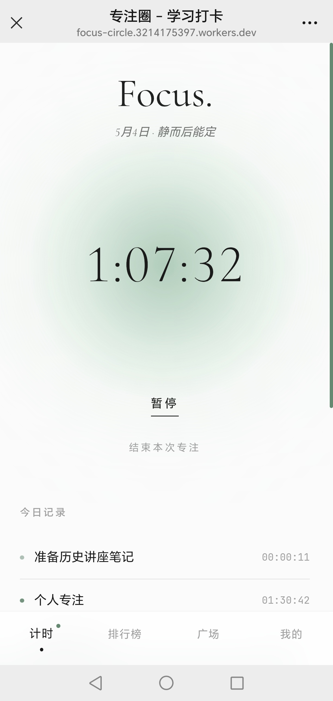
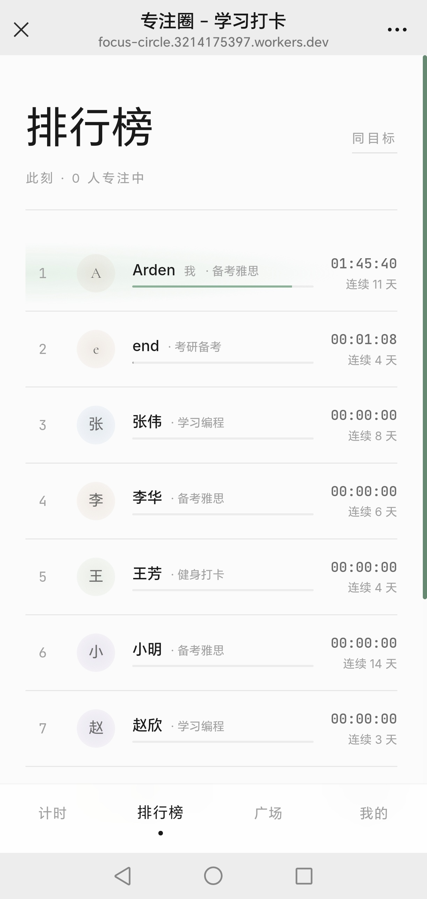
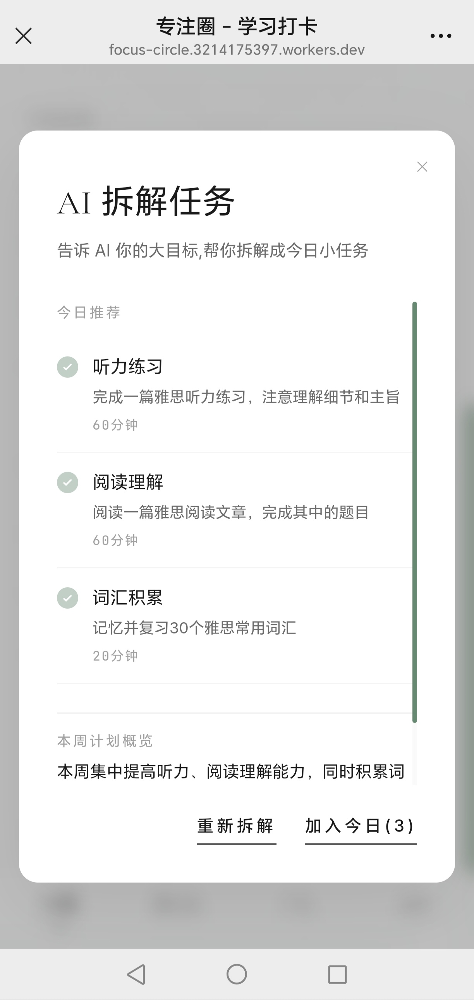
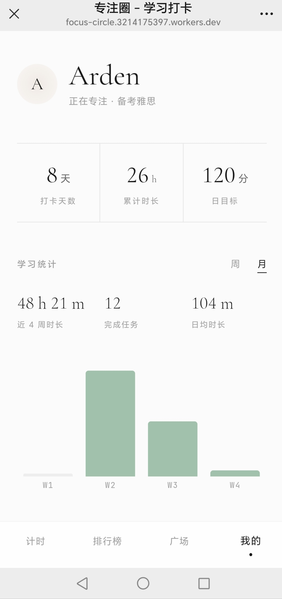

<div align="center">

# 专注圈 · Focus Circle

**静而后能定** · 一款面向学习社群的专注计时与协作应用

[🌐 在线体验](https://focus-circle-six.vercel.app/) &nbsp;·&nbsp; [📖 悬浮球 PRD](docs/floating-ball-prd.md) &nbsp;·&nbsp; [🎨 设计系统](src/app/globals.css)

    

</div>

---

## 一句话定位

正计时专注 + 每日任务 + 实时排行榜 + 桌面悬浮球 + AI 任务拆解，把"和大家一起学习"做成了一件有仪式感的事。

## 截图预览

| 计时器 | 实时排行榜 | AI 任务拆解 | 个人档案 |
| :-: | :-: | :-: | :-: |
|  |  |  |  |

## 核心特性

| | |
| :-: | --- |
| ⏳ | **专注计时** — 正计时模式，自由暂停/继续/结束，跨设备实时同步，离线自动恢复 |
| ✓ | **每日任务** — 可勾选的细粒度清单；接入智谱 GLM，可一键智能拆解大目标 |
| 🏆 | **实时排行榜** — 按当日专注时长排名，活跃用户脉冲指示，可按目标筛选 |
| 🌱 | **学习广场** — 社区分享学习资源，每日限发一条，让每次表达更有分量 |
| 👤 | **个人档案** — 设定每日目标与长期目标，柱状图回看历史专注 |
| 🛟 | **僵尸计时器恢复** — 超时 12 小时未结束的遗忘计时器自动检测，可保存/丢弃/继续 |
| 🔮 | **桌面悬浮球** — Electron 透明常驻悬浮窗，一眼掌握专注进度，可拖拽收纳 |
| 📱 | **PWA** — 可安装至桌面/手机，支持离线访问与后台缓存补传 |

## 灵气流动 · 设计系统

计时器是一颗会**呼吸的光球**。状态切换时，光晕颜色随之流转，形状始终如一：

- **Focus（进行中）** — 沉静的 sage 绿
- **Paused（暂停）** — 柔和的薰衣草紫
- **Complete（完成）** — 温暖的橙

完整 token（颜色 / 字体 / 圆角 / 动画）定义在 [src/app/globals.css](src/app/globals.css)，AuraHalo 实现见 [src/app/(main)/page.tsx](src/app/(main)/page.tsx)，悬浮球实现见 [src/app/ball/page.tsx](src/app/ball/page.tsx)。

## 技术栈

| 层级 | 技术 |
| --- | --- |
| 框架 | Next.js 16（App Router）|
| 前端 | React 19 · TypeScript 5 · Tailwind CSS 4 |
| 数据 / 认证 / 实时 | Supabase（PostgreSQL + Auth + Realtime）|
| AI | 智谱 GLM API（任务智能拆解）|
| 桌面端 | Electron 42（透明悬浮窗）|
| PWA | next-pwa |
| 图表 | Recharts |
| 部署 | Vercel · Cloudflare Workers（OpenNext）|

## 快速开始

```bash
git clone https://github.com/ArdenGao10/focus-circle.git
cd focus-circle
npm install
npm run dev          # http://localhost:3000
```

在项目根目录创建 `.env.local`：

```env
NEXT_PUBLIC_SUPABASE_URL=your_supabase_url
NEXT_PUBLIC_SUPABASE_ANON_KEY=your_anon_key
ZHIPU_API_KEY=your_zhipu_api_key
```

数据库结构见 [supabase-schema.sql](supabase-schema.sql)，在 Supabase 控制台 SQL Editor 一键执行即可初始化。

### 启动桌面悬浮球

需先启动 `npm run dev`，再另开一个终端：

```bash
npm run electron
```

会弹出一个透明的浮动小球窗口，与网页端共享同一份计时状态。

## 项目结构

```
src/
├── app/
│   ├── (main)/                # 需登录的主路由（带 BottomNav）
│   │   ├── page.tsx                # 计时器（首页，含 AuraHalo）
│   │   ├── leaderboard/            # 实时排行榜
│   │   ├── square/                 # 学习广场
│   │   ├── profile/                # 个人档案 + 历史柱状图
│   │   └── feedback/               # 用户反馈
│   ├── auth/                  # 登录 / 注册 / 找回密码
│   ├── onboarding/            # 新用户引导
│   ├── ball/                  # Electron 悬浮球窗口
│   ├── api/ai-tasks/          # AI 任务拆解接口
│   └── globals.css            # 灵气流动 设计 token
├── components/                # UI 组件 + Context（Timer / AppData / PWA）
├── lib/
│   ├── supabase/                  # client / server / middleware
│   ├── focusStats.ts              # 专注统计
│   └── avatarAura.ts              # 头像 aura 渐变
└── middleware.ts              # 路由守卫
electron/                      # Electron 主进程
docs/                          # 产品文档（PRD）
screenshots/                   # 应用截图
supabase-schema.sql            # 数据库初始化脚本
```

## 部署

### Vercel（推荐 · 已上线）

直接将仓库连接到 Vercel，会自动识别 Next.js。环境变量在 Vercel 控制台 Settings → Environment Variables 中配置。

生产环境：**https://focus-circle-six.vercel.app/**

### Cloudflare Workers

```bash
npm run deploy
```

走的是 `@opennextjs/cloudflare`，配置见 [open-next.config.ts](open-next.config.ts) 与 [wrangler.jsonc](wrangler.jsonc)。

## 脚本

| 命令 | 说明 |
| --- | --- |
| `npm run dev` | 启动开发服务器 |
| `npm run build` | 生产构建 |
| `npm run start` | 启动生产服务器 |
| `npm run lint` | ESLint 检查 |
| `npm run electron` | 启动桌面悬浮球（开发） |
| `npm run preview` | 本地预览 Cloudflare 构建产物 |
| `npm run deploy` | 部署到 Cloudflare Workers |

## License

MIT © [ArdenGao10](https://github.com/ArdenGao10)
